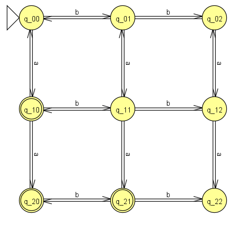
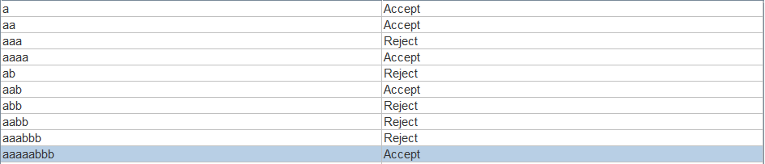
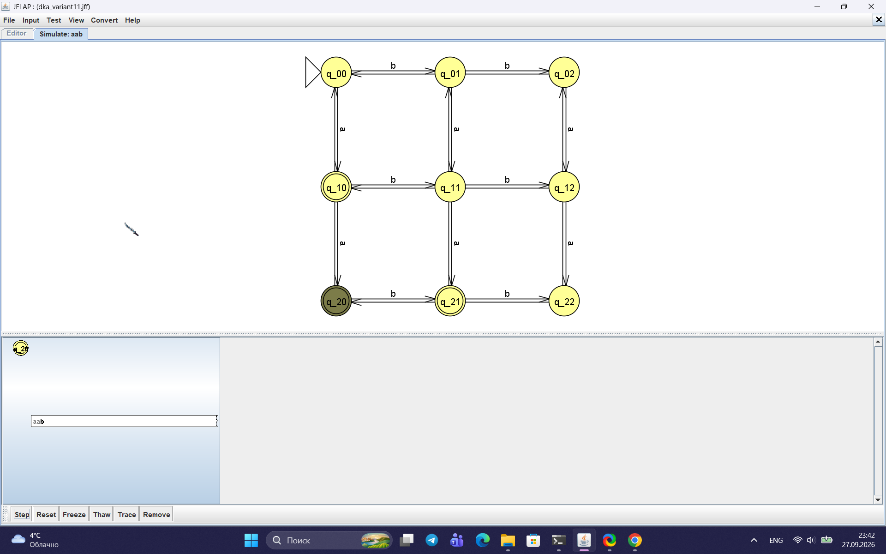
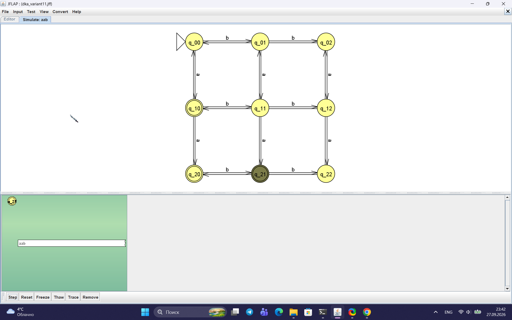
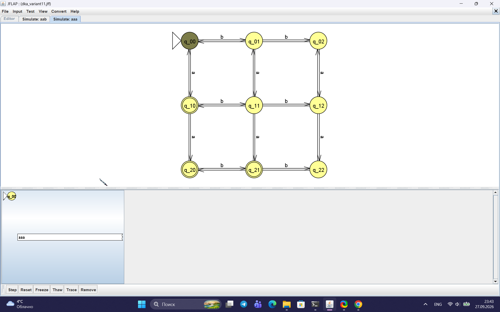
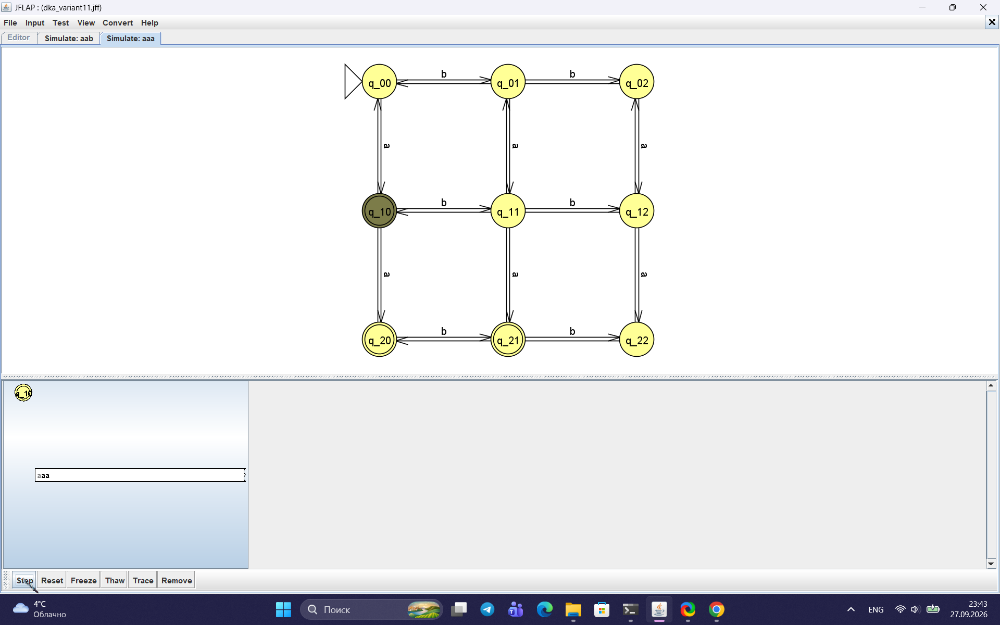
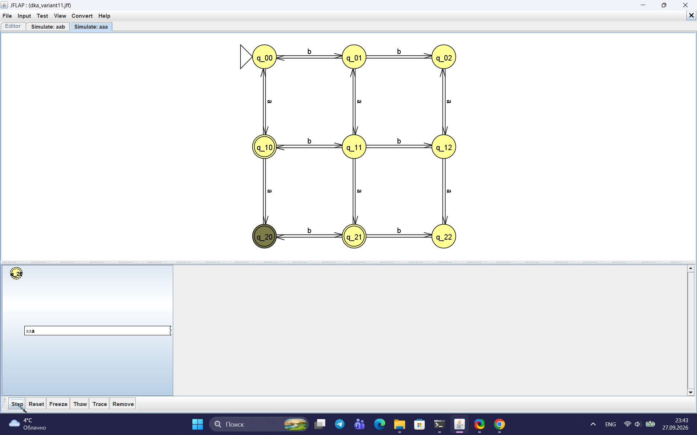
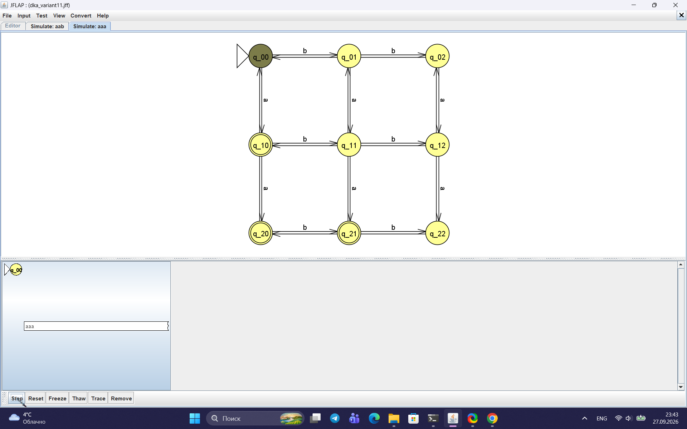
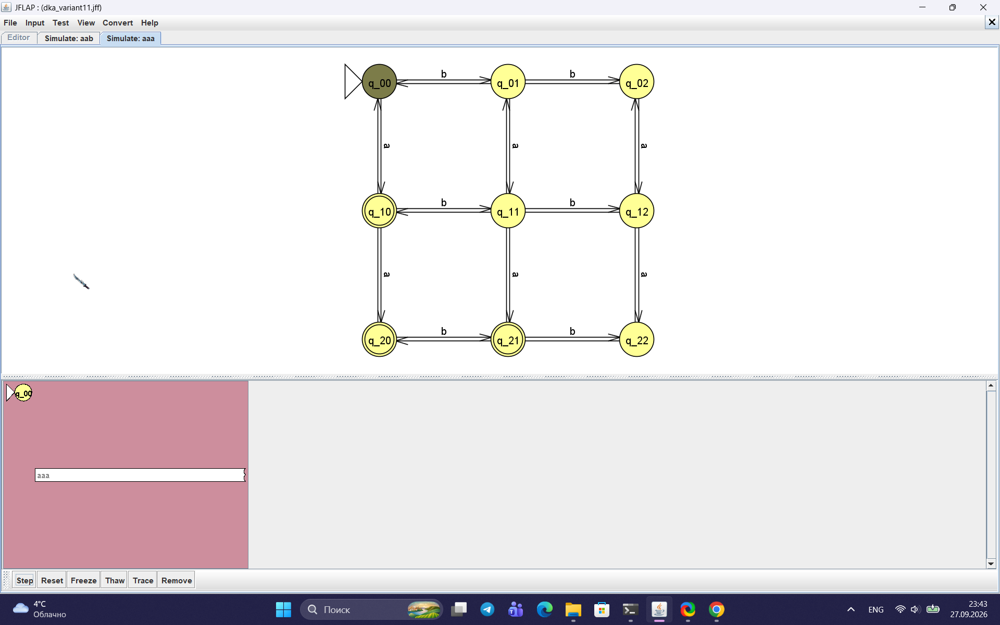

Министерство науки и высшего образования РФ

Федеральное государственное автономное образовательное учреждение высшего образования

**«СИБИРСКИЙ ФЕДЕРАЛЬНЫЙ УНИВЕРСИТЕТ»**

Институт космических и информационных технологий
Кафедра программной инженерии

---

# ОТЧЁТ №1

### по практической работе на тему «Конечные автоматы»

*(Теория автоматов, языков и вычислений)*

---

Преподаватель: А. С. Кузнецов

Студент: Шишко Д.Д, гр. КИ24-16/1б

Красноярск 2026

<!-- pagebreak -->

## 1 Цель работы и постановка задачи

**Цель работы** — изучить формальный аппарат теории конечных автоматов, построить детерминированный (ДКА) и недетерминированный (НКА) конечные автоматы в системе JFLAP для заданного варианта, выполнить их программную реализацию на языке Python в виде табличного представления и убедиться, что результаты работы программы совпадают с результатами работы JFLAP на одних и тех же тестовых цепочках.

**Вариант задания — № 11.**

> **а)** Построить ДКА, допускающий в алфавите {a, b} такие цепочки, в которых количество символов `a`, разделённое на 3, больше количества символов `b`, разделённого на 3.

*Примечание.* Условие «разделённое на 3» можно понимать по-разному. Если делить буквально, язык нерегулярный — ДКА не построить. Поэтому в работе условие понимается как сравнение остатков: `(na mod 3) > (nb mod 3)`. 

| Цепочка | `na` | `nb` | `na mod 3` | `nb mod 3` | Условие | Результат |
|---|---|---|---|---|---|---|
| `a` | 1 | 0 | 1 | 0 | 1 > 0 | принимается |
| `aa` | 2 | 0 | 2 | 0 | 2 > 0 | принимается |
| `aaa` | 3 | 0 | 0 | 0 | 0 > 0 — нет | отклоняется |
| `aaaa` | 4 | 0 | 1 | 0 | 1 > 0 | принимается |
| `ab` | 1 | 1 | 1 | 1 | 1 > 1 — нет | отклоняется |
| `aab` | 2 | 1 | 2 | 1 | 2 > 1 | принимается |
| `abb` | 1 | 2 | 1 | 2 | 1 > 2 — нет | отклоняется |
| `aabb` | 2 | 2 | 2 | 2 | 2 > 2 — нет | отклоняется |
| `aaabbb` | 3 | 3 | 0 | 0 | 0 > 0 — нет | отклоняется |
| `aaaaabbb` | 5 | 3 | 2 | 0 | 2 > 0 | принимается |

> **б)** Построить НКА, допускающий язык из цепочек из `0` и `1`, в которых каждая пара смежных нулей `00` находится перед парой смежных единиц `11`.

| Цепочка | Результат |
|---|---|
| `0011` | принимается |
| `001100` | отклоняется |
| `00110011` | принимается |
| `00` | отклоняется |
| `010` | принимается |
| `1100` | отклоняется |
| `110011` | принимается |
| `1111` | принимается |

## 2 Построение автоматов

### 2.1 ДКА (пункт а)

Чтобы проверить условие `(na mod 3) > (nb mod 3)`, автомату достаточно помнить два остатка — `na mod 3` и `nb mod 3`. Каждый остаток принимает значения `{0, 1, 2}`. Значит, состояние ДКА — это пара `(i, j)`, где `i = na mod 3`, `j = nb mod 3`. Всего `3 × 3 = 9` состояний.

Правила переходов:

- по символу `a`: `(i, j) → ((i+1) mod 3, j)`;
- по символу `b`: `(i, j) → (i, (j+1) mod 3)`.

**Начальное состояние:** `(0, 0)`.
**Допускающие состояния:** все пары, где `i > j`: `(1,0)`, `(2,0)`, `(2,1)`.

Функция переходов:

| Состояние | по `a` | по `b` | Допускающее? |
|-----------|--------|--------|--------------|
| (0,0) | (1,0) | (0,1) | нет |
| (0,1) | (1,1) | (0,2) | нет |
| (0,2) | (1,2) | (0,0) | нет |
| (1,0) | (2,0) | (1,1) | **да** |
| (1,1) | (2,1) | (1,2) | нет |
| (1,2) | (2,2) | (1,0) | нет |
| (2,0) | (0,0) | (2,1) | **да** |
| (2,1) | (0,1) | (2,2) | **да** |
| (2,2) | (0,2) | (2,0) | нет |

Итоговый автомат содержит **9 состояний**.

### 2.2 НКА (пункт б)

НКА угадывает, какая пара `11` будет последней. После последней `11` в цепочке не должно быть `00`. Если `11` в цепочке нет вообще, то и `00` быть не должно.

Состояния НКА:

- `S` — начальное состояние;
- `P0` — ищем `11`, последний символ не `1`;
- `P1` — ищем `11`, последний символ `1`;
- `C` — зафиксировали последнюю `11`, хвост пуст (принимающее);
- `D` — в хвосте прочитали `0`, ждём `1`;
- `E` — хвост без `00` продолжается (принимающее);
- `F` — режим «нет `11`», последний символ не `0` (принимающее);
- `G` — режим «нет `11`», последний символ `0` (принимающее).

Функция переходов:

| Состояние | `0` | `1` | ε |
|---|---|---|---|
| `S` | — | — | `P0`, `F` |
| `P0` | `P0` | `P1` | — |
| `P1` | `P0` | `P1`, `C` | — |
| `C` | `D` | `E` | — |
| `D` | — | `E` | — |
| `E` | `D` | `E` | — |
| `F` | `G` | `F` | — |
| `G` | — | `F` | — |

Недетерминизм достигается за счёт перехода `P1 --1--> P1, C`: автомат либо продолжает искать `11`, либо фиксирует текущую `11` как последнюю.

## 3 Графы переходов полученных ДКА и НКА

Граф переходов ДКА (9 состояний, сетка 3×3) приведён на рисунке 1.



Рисунок 1 — Граф переходов ДКА

Граф переходов НКА (8 состояний) приведён на рисунке 2.


Рисунок 2 — Граф переходов НКА

## 4 Перехваты экранов при пошаговом выполнении процесса распознавания

### 4.1 Проверка ДКА в режиме Multiple Run

Результат прогона набора тестовых цепочек ДКА в режиме Multiple Run показан на рисунке 3.



Рисунок 3 — Multiple Run для ДКА

### 4.2 Пошаговое распознавание цепочки `aab` (ДКА, цепочка допускается)

Цепочка `aab`: `na = 2`, `nb = 1`, `2 mod 3 = 2`, `1 mod 3 = 1`, `2 > 1` — истина. Цепочка должна быть допущена.

Ожидаемая последовательность состояний:

```
q_00 --a--> q_10 --a--> q_20 --b--> q_21
```

Финальное состояние `q_21` — допускающее. Пошаговый прогон показан на рисунках 4–7.


Рисунок 4 — Начальное состояние `q_00`


Рисунок 5 — После первой `a`, состояние `q_10`



Рисунок 6 — После второй `a`, состояние `q_20`



Рисунок 7 — После `b`, состояние `q_21` (допускающее), цепочка допущена

### 4.3 Пошаговое распознавание цепочки `aaa` (ДКА, цепочка отклоняется)

Цепочка `aaa`: `na = 3`, `nb = 0`, `3 mod 3 = 0`, `0 mod 3 = 0`, `0 > 0` — ложь. Цепочка должна быть отклонена.

Ожидаемая последовательность состояний:

```
q_00 --a--> q_10 --a--> q_20 --a--> q_00
```

Финальное состояние `q_00` — не допускающее. Пошаговый прогон показан на рисунках 8–12.



Рисунок 8 — Начальное состояние `q_00`



Рисунок 9 — После первой `a`, состояние `q_10`



Рисунок 10 — После второй `a`, состояние `q_20`



Рисунок 11 — После третьей `a`, состояние `q_00`



Рисунок 12 — Финал, `q_00` (не допускающее), цепочка отклонена

### 4.4 Проверка НКА в режиме Multiple Run

Результат прогона набора тестовых цепочек НКА в режиме Multiple Run показан на рисунке 13.


Рисунок 13 — Multiple Run для НКА

### 4.5 Пошаговое распознавание цепочки `0011` (НКА, цепочка допускается)

Цепочка `0011` содержит `00` (позиции 0–1) и `11` после него (позиции 2–3), значит цепочка должна быть допущена. Ожидаемая последовательность активных множеств:

```
{S, P0, F} --0--> {P0, G} --0--> {P0} --1--> {P1} --1--> {P1, C}
```

Финальное множество содержит `C` — принимающее состояние. Пошаговый прогон показан на рисунках 14–18.


Рисунок 14 — Начальное состояние `{S, P0, F}`


Рисунок 15 — После первого `0`: `{P0, G}`


Рисунок 16 — После второго `0`: `{P0}`


Рисунок 17 — После первого `1`: `{P1}`


Рисунок 18 — Финал `{P1, C}`, цепочка допущена

### 4.6 Пошаговое распознавание цепочки `001100` (НКА, цепочка отклоняется)

Цепочка `001100` содержит второе `00` после `11`, после которого нет `11`, значит цепочка должна быть отклонена:

```
{P0, F} --0--> {P0, G} --0--> {P0} --1--> {P1} --1--> {P1, C} --0--> {P0, D} --0--> {P0}
```

Финальное множество `{P0}` не содержит принимающих состояний. Кадры показаны на рисунках 19–20.


Рисунок 19 — Начальное состояние


Рисунок 20 — Финал `{P0}`, цепочка отклонена

### 4.7 Пошаговое распознавание цепочки `010` (НКА, цепочка допускается)

Цепочка `010` не содержит `00`, значит условие выполнено вакуумно:

```
{S, P0, F} --0--> {P0, G} --1--> {P1, F} --0--> {P0, G}
```

Финальное множество содержит `G` — принимающее состояние. Кадры показаны на рисунках 21–22.


Рисунок 21 — Начальное состояние


Рисунок 22 — Финал `{P0, G}`, цепочка допущена

## 5 Программная реализация

Программная реализация выполнена на языке Python в виде табличного представления переходов. Строковые функции обработки данных не используются — входные цепочки представлены списками символов, что соответствует требованию задания.

### 5.1 Пункт а — программа `a.py`

Программа реализует ДКА на 9 состояниях с табличным представлением переходов:

```python
delta = [[0, 0] for _ in range(NUM_STATES)]
for i in range(3):
    for j in range(3):
        s = i * 3 + j
        delta[s][0] = ((i + 1) % 3) * 3 + j
        delta[s][1] = i * 3 + ((j + 1) % 3)
```

Вывод программы — таблица «цепочка → Accept/Reject», как в JFLAP:

```
a                    Accept
aa                   Accept
aaa                  Reject
aaaa                 Accept
ab                   Reject
aab                  Accept
abb                  Reject
aabb                 Reject
aaabbb               Reject
aaaaabbb             Accept
```

### 5.2 Пункт б — программа `b.py`

Программа реализует НКА из раздела 2.2 с табличным представлением переходов:

```python
delta = [[[] for _ in range(3)] for _ in range(NUM_STATES)]
delta[S][2]  = [P0, F]
delta[P0][0] = [P0]
delta[P0][1] = [P1]
delta[P1][0] = [P0]
delta[P1][1] = [P1, C]
# ...
```

Реализованы процедуры `epsilon_closure` и `move`. Вывод — таблица «цепочка → Accept/Reject»:

```
0011                 Accept
001100               Reject
00110011             Accept
00                   Reject
010                  Accept
1100                 Reject
110011               Accept
1111                 Accept
```

## 6 Заключение

В ходе выполнения практической работы получены следующие навыки: построение формального описания конечного автомата; проектирование и тестирование ДКА и НКА в системе JFLAP; программная реализация конечных автоматов через табличное представление переходов на языке Python.

Для пункта (а) построен ДКА на 9 состояниях (условие понимается как сравнение остатков по модулю 3). Для пункта (б) построен НКА на 8 состояниях. Результаты работы программ совпадают с результатами JFLAP на всех тестовых цепочках.