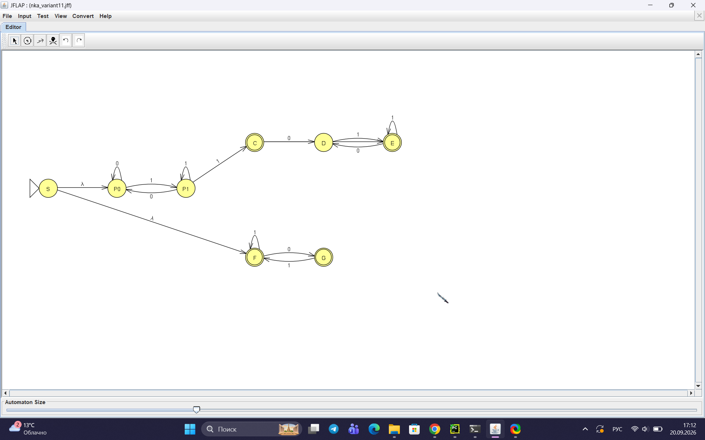
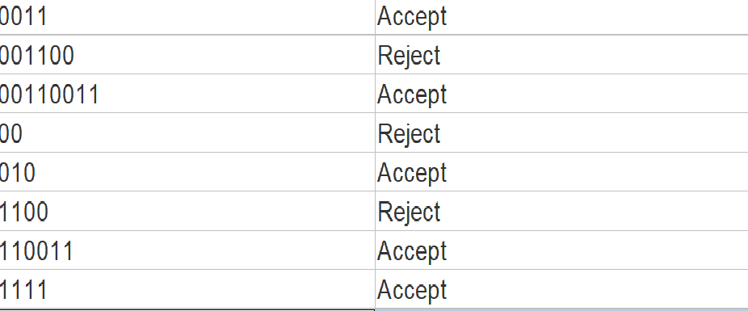
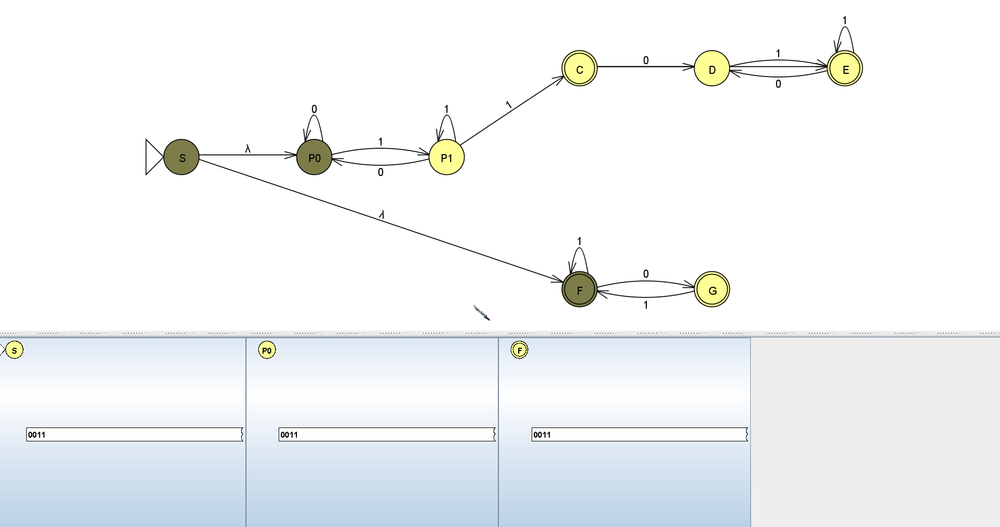
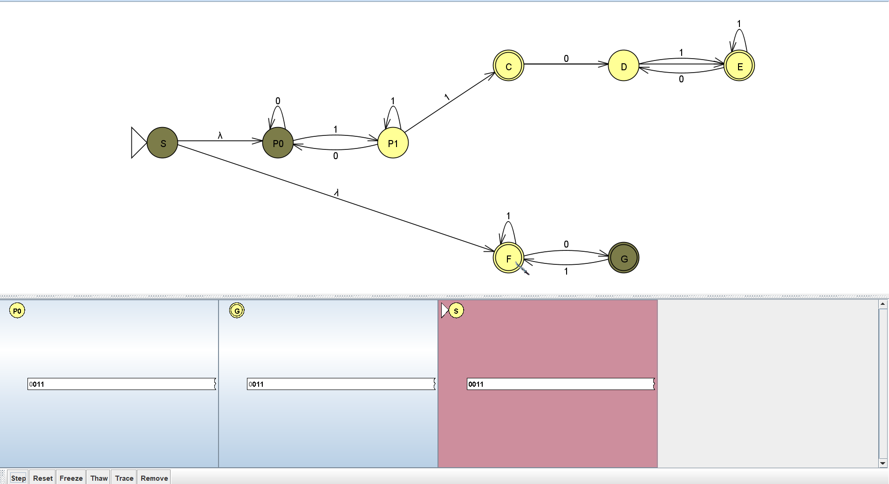
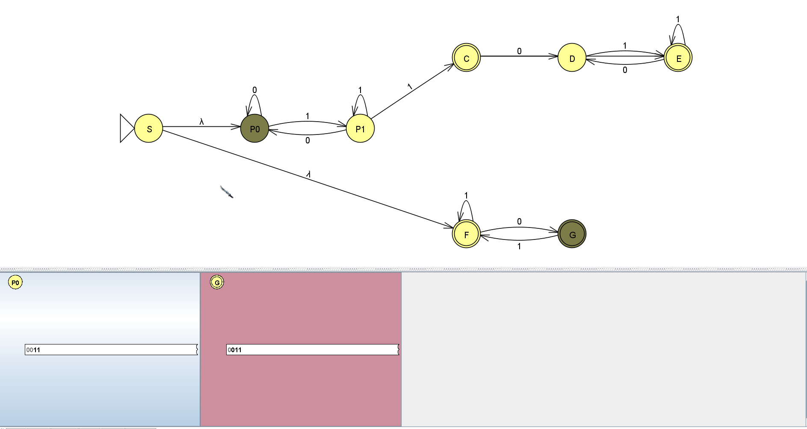
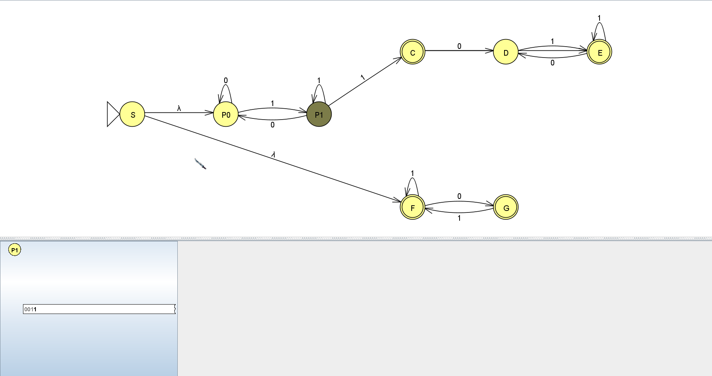
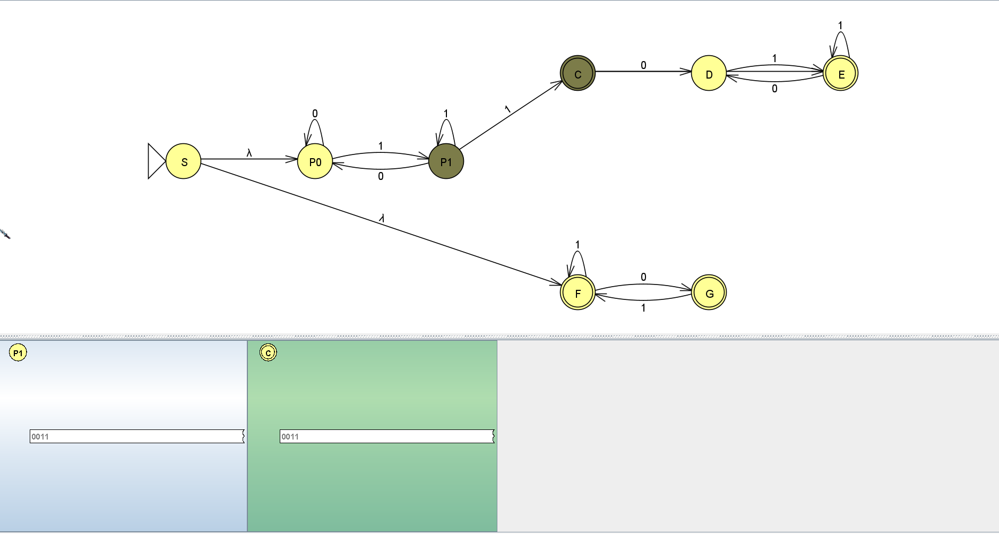
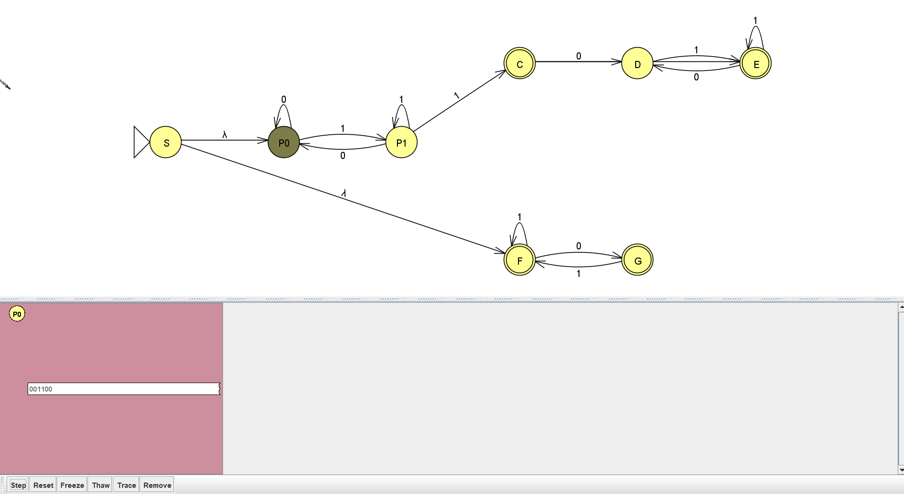
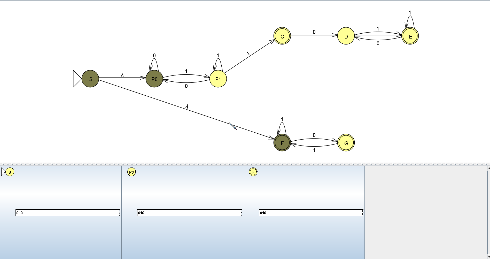
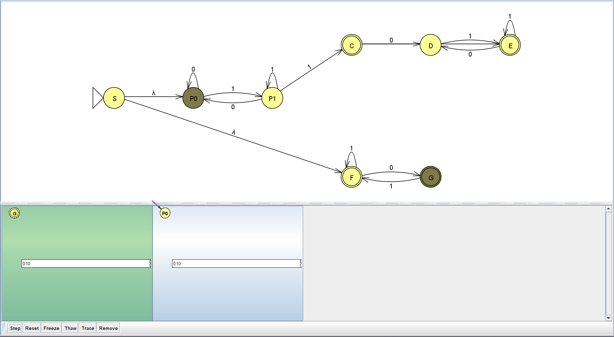

Министерство науки и высшего образования РФ

Федеральное государственное автономное образовательное учреждение высшего образования

**«СИБИРСКИЙ ФЕДЕРАЛЬНЫЙ УНИВЕРСИТЕТ»**

Институт космических и информационных технологий
Кафедра программной инженерии

---

# ОТЧЁТ №1

### по практической работе на тему «Конечные автоматы»

*(Теория автоматов, языков и вычислений)*

---

Преподаватель: А. С. Кузнецов

Студент: Шишко Д.Д., гр. КИ24-16/1Б

Красноярск 2026

<!-- pagebreak -->

## 1 Цель работы и постановка задачи

**Цель работы** — изучить формальный аппарат теории конечных автоматов, построить детерминированный (ДКА) и недетерминированный (НКА) конечные автоматы в системе JFLAP для заданного варианта, выполнить их программную реализацию на языке Python в виде табличного представления и убедиться, что результаты работы программы совпадают с результатами работы JFLAP на одних и тех же тестовых цепочках.

**Вариант задания — № 11.**

> **а)** Построить ДКА, допускающий в алфавите {a, b} такие цепочки, в которых количество символов `a`, разделённое на 3, больше количества символов `b`, разделённого на 3.

| Цепочка | `a` | `b` | `a//3` | `b//3` | Условие | Результат |
|---|---|---|---|---|---|---|
| `aaa` | 3 | 0 | 1 | 0 | 1 > 0 | принимается |
| `aaabbb` | 3 | 3 | 1 | 1 | 1 > 1 — нет | отклоняется |
| `aaaaaa` | 6 | 0 | 2 | 0 | 2 > 0 | принимается |
| `aaaaaabbb` | 6 | 3 | 2 | 1 | 2 > 1 | принимается |
| `aaaaaabbbbbb` | 6 | 6 | 2 | 2 | 2 > 2 — нет | отклоняется |
| `ab` | 1 | 1 | 0 | 0 | 0 > 0 — нет | отклоняется |
| пустая | 0 | 0 | 0 | 0 | 0 > 0 — нет | отклоняется |

> **б)** Построить НКА, допускающий язык из цепочек из `0` и `1`, в которых каждая пара смежных нулей `00` находится перед парой смежных единиц `11`.

| Цепочка | Результат |
|---|---|
| `0011` | принимается |
| `001100` | отклоняется |
| `00110011` | принимается |
| `00` | отклоняется |
| `010` | принимается |
| `1100` | отклоняется |
| `110011` | принимается |
| `1111` | принимается |
| пустая | принимается |

## 2 Построение автоматов

### 2.1 ДКА (пункт а) — доказательство невозможности построения

Ключевая идея: язык задаётся условием `na // 3 > nb // 3`, где `na` и `nb` — количества символов `a` и `b` соответственно, а `//` — целочисленное деление (отбрасывание остатка). Это условие зависит от **точной** разности `na // 3 − nb // 3`, которая может принимать сколь угодно большие значения. ДКА же имеет **конечное** число состояний, поэтому он не способен «помнить» произвольно большую разность.

Докажем это формально. Предположим, что ДКА для данного языка существует и имеет `k` состояний. Рассмотрим `k+1` цепочек вида `a^{3i}` для `i = 0, 1, ..., k` (то есть цепочки из 0, 3, 6, …, `3k` символов `a`). По принципу Дирихле найдутся две цепочки `a^{3i}` и `a^{3j}` (`i < j`), которые приводят автомат в одно и то же состояние `q`.

Припишем к обеим цепочкам одинаковый хвост `b^{3i}`:

- Цепочка `a^{3i} b^{3i}`: количество `a` равно `3i`, количество `b` равно `3i`. Тогда `a//3 = i`, `b//3 = i`, условие `i > i` ложно → цепочка **должна быть отклонена**.
- Цепочка `a^{3j} b^{3i}`: количество `a` равно `3j`, количество `b` равно `3i`. Тогда `a//3 = j`, `b//3 = i`, условие `j > i` истинно → цепочка **должна быть допущена**.

Но автомат из состояния `q` по одному и тому же хвосту `b^{3i}` обязан прийти в одно и то же финальное состояние, то есть дать одинаковый ответ на обе цепочки. Получаем противоречие: одна цепочка должна быть отклонена, другая — допущена. Следовательно, **ДКА для данного языка не существует**.

### 2.2 НКА (пункт б)

Ключевая идея: НКА **угадывает**, какая пара `11` будет последней. После последней `11` в цепочке не должно быть `00`. Если `11` в цепочке нет вообще, то и `00` быть не должно — в этом случае условие «каждое `00` перед `11`» выполнено вакуумно.

Состояния НКА:

- `S` — начальное состояние;
- `P0` — ищем `11`, последний символ не `1`;
- `P1` — ищем `11`, последний символ `1`;
- `C` — зафиксировали последнюю `11`, хвост пуст (принимающее);
- `D` — в хвосте прочитали `0`, ждём `1`;
- `E` — хвост без `00` продолжается (принимающее);
- `F` — режим «нет `11`», последний символ не `0` (принимающее);
- `G` — режим «нет `11`», последний символ `0` (принимающее).

Функция переходов:

| Состояние | `0` | `1` | ε |
|---|---|---|---|
| `S` | — | — | `P0`, `F` |
| `P0` | `P0` | `P1` | — |
| `P1` | `P0` | `P1`, `C` | — |
| `C` | `D` | `E` | — |
| `D` | — | `E` | — |
| `E` | `D` | `E` | — |
| `F` | `G` | `F` | — |
| `G` | — | `F` | — |

Недетерминизм достигается за счёт перехода `P1 --1--> P1, C`: автомат либо продолжает искать `11`, либо фиксирует текущую `11` как последнюю. Именно это и отличает НКА от ДКА — для пары (`P1`, `1`) определено сразу два возможных следующих состояния.

## 3 Графы переходов полученных ДКА и НКА

Для пункта (а) граф ДКА **не строится**, так как ДКА не существует. Вместо графа в разделе 2.1 приведено формальное доказательство невозможности его построения.

Граф переходов НКА (8 состояний, видны ε-переходы из `S` и ветвление по `1` из `P1`) приведён на рисунке 1.



Рисунок 1 — Граф переходов НКА

## 4 Перехваты экранов при пошаговом выполнении процесса распознавания

### 4.1 Проверка НКА в режиме Multiple Run

Результат прогона всего набора тестовых цепочек НКА в режиме Multiple Run показан на рисунке 2.



Рисунок 2 — Multiple Run для НКА

### 4.2 Пошаговое распознавание цепочки `0011` (НКА, цепочка допускается)

Цепочка `0011` содержит `00` (позиции 0–1) и `11` после него (позиции 2–3), значит цепочка должна быть допущена. Ожидаемая последовательность активных множеств:

```
{S, P0, F} --0--> {P0, G} --0--> {P0} --1--> {P1} --1--> {P1, C}
```

Финальное множество содержит `C` — принимающее состояние, следовательно цепочка допускается. Пошаговый прогон в JFLAP показан на рисунках 3–7.



Рисунок 3 — Начальное состояние, активны `{S, P0, F}`



Рисунок 4 — Активные состояния `{P0, G}` после чтения первого `0`



Рисунок 5 — Активные состояния `{P0}` после чтения второго `0`



Рисунок 6 — Активные состояния `{P1}` после чтения первого `1`



Рисунок 7 — Финальное множество `{P1, C}`, цепочка допущена

### 4.3 Пошаговое распознавание цепочки `001100` (НКА, цепочка отклоняется)

Цепочка `001100` содержит второе `00` после `11`, после которого нет `11`, значит цепочка должна быть отклонена:

```
{P0, F} --0--> {P0, G} --0--> {P0} --1--> {P1} --1--> {P1, C} --0--> {P0, D} --0--> {P0}
```

Финальное множество `{P0}` не содержит принимающих состояний, следовательно цепочка отклоняется. Соответствующие кадры показаны на рисунках 8–9.


Рисунок 8 — Начальное состояние, до чтения цепочки `001100`



Рисунок 9 — Финальное множество `{P0}`, цепочка отклонена

### 4.4 Пошаговое распознавание цепочки `010` (НКА, цепочка допускается)

Цепочка `010` не содержит `00`, значит условие выполнено вакуумно, цепочка должна быть допущена:

```
{S, P0, F} --0--> {P0, G} --1--> {P1, F} --0--> {P0, G}
```

Финальное множество содержит `G` — принимающее состояние, следовательно цепочка допускается. Кадры показаны на рисунках 10–11.



Рисунок 10 — Начальное состояние, до чтения цепочки `010`



Рисунок 11 — Финальное множество `{P0, G}`, цепочка допущена

## 5 Программная реализация

Программная реализация выполнена на языке Python в виде табличного представления переходов. Строковые функции обработки данных не используются — входные цепочки представлены списками символов, что соответствует требованию задания.

### 5.1 Пункт а — программа `a.py`

Так как ДКА для языка из пункта (а) не существует, программа реализует **проверку условия языка** напрямую: подсчитывает количество символов `a` и `b`, выполняет целочисленное деление на 3 и сравнивает результаты.

```python
def check_a(word):
    na = 0
    nb = 0
    for c in word:
        if c == 'a':
            na += 1
        elif c == 'b':
            nb += 1
        else:
            return False
    return (na // 3) > (nb // 3)
```

Программа демонстрирует, что язык распознаваем алгоритмически, однако, как показано в разделе 2.1, **не существует ДКА**, который бы его распознавал.

### 5.2 Пункт б — программа `b.py`

Программа реализует НКА из раздела 2.2 с использованием табличного представления переходов:

```python
# Таблица переходов: delta[состояние][символ] = список состояний
delta = [[[] for _ in range(3)] for _ in range(NUM_STATES)]
delta[S][2]  = [P0, F]        # epsilon-переходы из S
delta[P0][0] = [P0]
delta[P0][1] = [P1]
delta[P1][0] = [P0]
delta[P1][1] = [P1, C]        # недетерминизм
# ... и так далее
```

Реализованы процедуры `epsilon_closure` (замыкание по ε-переходам) и `move` (шаг автомата по символу). Результат работы программы пошагово выводит множество активных состояний и полностью совпадает с выводом JFLAP на тех же тестовых цепочках.

## 6 Заключение

В ходе выполнения практической работы получены следующие навыки: построение формального описания конечного автомата (алфавит, состояния, функция переходов, начальное и принимающие состояния); доказательство невозможности построения ДКА для заданного языка; проектирование и тестирование НКА в системе JFLAP; программная реализация конечных автоматов через табличное представление переходов на языке Python.

Для пункта (а) формально доказано, что ДКА не существует. Для пункта (б) построен НКА с 8 состояниями, проведена его проверка в JFLAP и программная реализация, результаты которой совпадают с результатами JFLAP на всех тестовых цепочках.